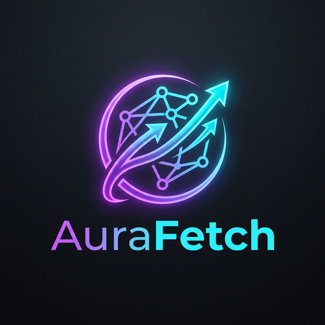
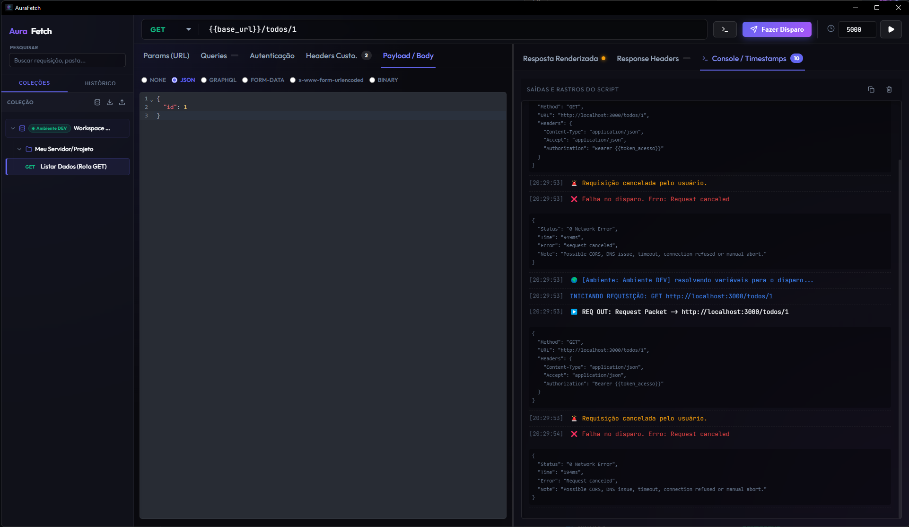

<div align="center">
  
  <h1>🚀 AuraFetch</h1>
  <p><b>The Modern, Lightning-Fast API Client for Desktop</b></p>
  <p>A lightweight alternative to Postman & Insomnia — built with Tauri, React & TypeScript.</p>

  <br/>

  [](https://github.com/eder-ferraz-caciano/AuraFetch/releases/latest)
  [](LICENSE)
  [](https://github.com/eder-ferraz-caciano/AuraFetch/stargazers)
  [](https://github.com/eder-ferraz-caciano/AuraFetch/releases)
  [](https://tauri.app)
  [](https://react.dev)

  <br/><br/>

  

  <br/><br/>
</div>

---

## 💡 Why AuraFetch?

Most API clients are **heavy Electron apps** that consume 500MB+ of RAM just to send a GET request. AuraFetch is different:

| | AuraFetch | Postman | Insomnia |
|---|:---:|:---:|:---:|
| **RAM Usage** | ~50MB | ~500MB | ~300MB |
| **Startup Time** | <1s | 5-10s | 3-5s |
| **Bundle Size** | ~8MB | ~200MB | ~80MB |
| **Offline First** | ✅ | ❌ | ❌ |
| **Open Source** | ✅ | ❌ | Partially |
| **Native Desktop** | ✅ Rust | ❌ Electron | ❌ Electron |

> **AuraFetch is built with Tauri (Rust)** — no Electron, no Chromium bundled, no bloat. It's a native desktop application that feels like a web app.

---

## ✨ Features

### 🔥 Core
- ⚡ **Instant Load** — Native Rust backend, loads in under 1 second
- 🌐 **All HTTP Methods** — GET, POST, PUT, PATCH, DELETE, HEAD, OPTIONS
- 📦 **Multiple Body Types** — JSON, Form-Data, x-www-form-urlencoded, Binary, None
- 🔐 **Authentication** — Bearer Token, Basic Auth, Custom Headers
- 📁 **Collections & Folders** — Organize requests with drag & drop reordering
- 💾 **Auto-Save** — Your entire workspace persists automatically via local storage

### 🎯 Professional
- 🌍 **Environment Variables** — Create environments (DEV, STAGING, PROD) with `{{variables}}` interpolation in URLs, headers, and body
- � **Pre-Request Scripts (JS)** — Write vanilla JavaScript per folder to automate login flows, generate tokens, and inject variables with `aurafetch.setEnv()`
- 🎨 **CodeMirror Editor** — Full syntax highlighting with OneDark theme for JSON/JS editing
- 🕵️ **Console & Timestamps** — Deep debugging panel that traces every request lifecycle
- 📋 **Response Inspector** — Rendered view, Response Headers, Console logs — all in tabbed panels

### 🖥️ Desktop Experience
- �️ **Drag & Drop** — Reorder requests and folders with intuitive drag & drop
- � **Export / Import** — Share your workspace as `.json` with your team
- � **Code Snippet Generator** — Auto-generate `cURL`, `fetch`, and `axios` code from any request
- 🖼️ **Rich Responses** — Renders JSON, HTML, Images, PDFs, and detects binary files automatically
- 📥 **Download Responses** — Save any response directly to disk

---

## 🚀 Download

<div align="center">

### ⬇️ [Download Latest Release (Windows .exe)](https://github.com/eder-ferraz-caciano/AuraFetch/releases/latest)

*macOS and Linux builds coming soon!*

</div>

---

## 💻 Building from Source

### Prerequisites
- **Node.js** v18+ ([download](https://nodejs.org/))
- **Rust** + Cargo ([install via rustup](https://rustup.rs/))
- **Yarn** package manager
- **Tauri CLI prerequisites** — [Windows setup guide](https://v2.tauri.app/start/prerequisites/#windows)

### Quick Start

```bash
# 1. Clone the repository
git clone https://github.com/eder-ferraz-caciano/AuraFetch.git
cd AuraFetch

# 2. Install dependencies
yarn install

# 3. Run in development mode
yarn tauri dev

# 4. Build the production installer
yarn tauri build
```

The compiled `.exe` and `.msi` installer will be generated in:
```
src-tauri/target/release/bundle/
```

---

## 🧪 Testing

AuraFetch includes a comprehensive Cypress E2E test suite covering all professional features:

```bash
# Run all E2E tests (headless)
npx cypress run

# Open Cypress interactive runner
yarn cypress:open
```

**Test coverage includes:** Custom Headers, JSON/Form-Data/URL-Encoded Body, Environment Variables, Folder Scripts, Response Headers, Console Logs.

---

## 🛠️ Tech Stack

<div align="center">

| Layer | Technology |
|-------|-----------|
| **Backend** | [Tauri 2](https://tauri.app) (Rust) |
| **Frontend** | [React 19](https://react.dev) + TypeScript |
| **Bundler** | [Vite 7](https://vite.dev) |
| **Editor** | [CodeMirror 6](https://codemirror.net/) |
| **Icons** | [Lucide React](https://lucide.dev) |
| **Testing** | [Cypress 15](https://cypress.io) |

</div>

---

## 🗺️ Roadmap

- [x] Full HTTP method support (GET, POST, PUT, PATCH, DELETE, HEAD, OPTIONS)
- [x] Environment variables with `{{interpolation}}`
- [x] Pre-request JavaScript scripts per folder
- [x] Drag & Drop collection reordering
- [x] Code Snippet Generator (cURL, fetch, axios)
- [x] Response rendering (JSON, HTML, Images, PDF, Binary)
- [x] Export / Import workspace
- [x] Cypress E2E test suite
- [x] WebSocket support
- [x] GraphQL support
- [ ] Team collaboration & cloud sync
- [ ] Plugin system
- [ ] macOS & Linux builds
- [ ] Code-signed releases (SignPath.io)

---

## 🤝 Contributing

Contributions, issues, and feature requests are welcome! Feel free to check the [issues page](https://github.com/eder-ferraz-caciano/AuraFetch/issues).

1. Fork the project
2. Create your feature branch (`git checkout -b feature/amazing-feature`)
3. Commit your changes (`git commit -m 'feat: add amazing feature'`)
4. Push to the branch (`git push origin feature/amazing-feature`)
5. Open a Pull Request

---

## 📝 License

This project is [MIT](LICENSE) licensed.

---

<div align="center">
  <br/>
  <p>Built with ❤️ by <a href="https://github.com/eder-ferraz-caciano">Eder Ferraz Caciano</a></p>
  <p><sub>If you find AuraFetch useful, consider giving it a ⭐ on GitHub!</sub></p>
</div>
